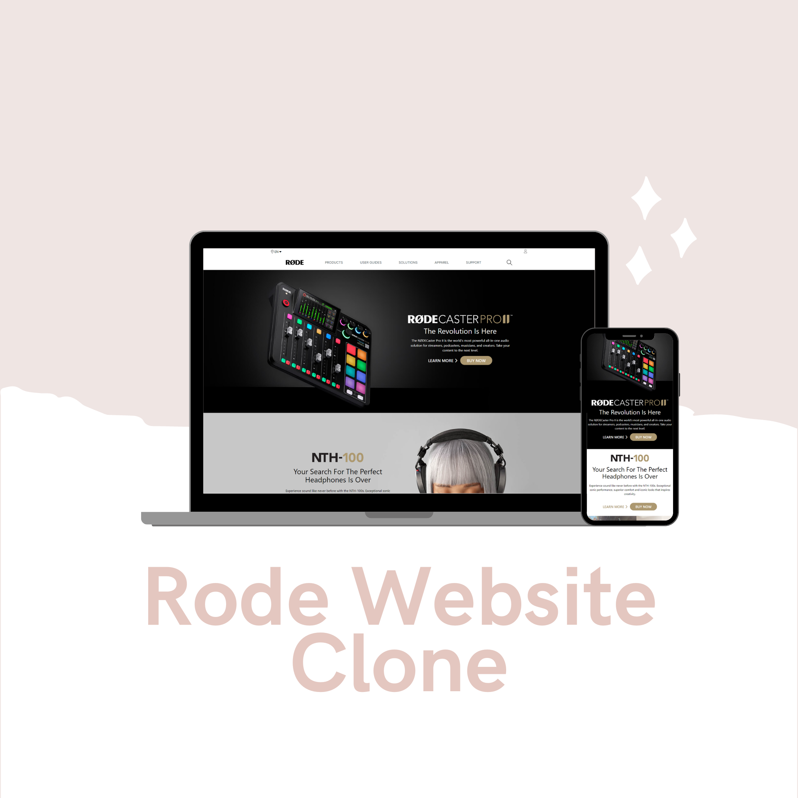
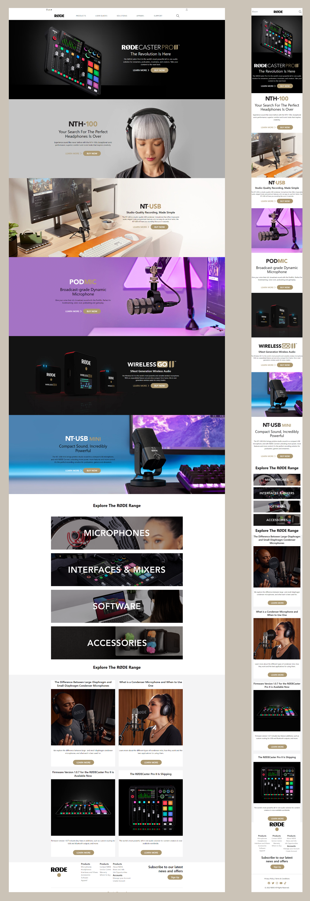

# Rode Landing page (UI only) Fully Responsive

[Hosted Link](https://rode-clone.netlify.app/)\
A landing page to improve TelwindCSS skill.

## Key Learnings

- use of TelwindCSS's utility classes
- Use of breakpoints to make webpage responsive
- Customize Configuration for custom style like; font, bg images, color, etc.

## Tech Stack

## Screenshots

<!-- ## Font Reference

| Font     | Link                                                                     |
| -------- | ------------------------------------------------------------------------ |
| Orbitron | [Google font](https://fonts.google.com/specimen/Orbitron?query=orbitron) |
| Popins   | [Google font](https://fonts.google.com/specimen/Poppins?query=pop)       | -->

## Color Reference

| Color | Hex                                                              |
| ----- | ---------------------------------------------------------------- |
| Brown |  #ac9870 |

# Hi, I'm Subrata! 👋

## 🚀 About Me

A passionate frontend developer from India. Currently pursing Bachlor in Technology in Computer Science and Engineering.

## 🔗 Contact Me

